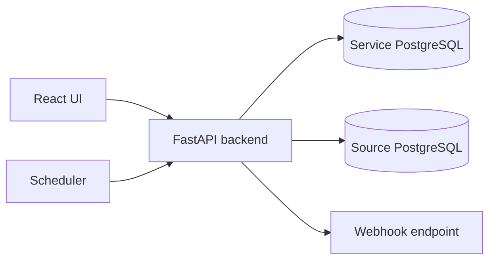

# DQ Time Series Service

DQ Time Series Service - MVP-сервис для мониторинга качества данных в PostgreSQL на основе временных рядов. Он помогает быстро увидеть, что в данных изменилось не так: резко просел поток строк, выросла доля `NULL`, сломалось распределение сумм, пропали уникальные значения или появилась другая аномалия.

Проект ориентирован на data engineering, data quality и аналитические команды, которым нужно не просто запускать разовые SQL-проверки, а отслеживать поведение метрик во времени.

## Какую проблему решает

Классические data quality-проверки часто отвечают на вопрос “прошли ли данные фиксированное правило”. Но многие реальные сбои выглядят иначе:

- вчера 10 000 строк в час было нормально, а сегодня 2 000 - уже инцидент;
- средний чек не нарушил жесткий лимит, но резко ушел от привычного диапазона;
- доля пустых значений растет постепенно, и это видно только в динамике;
- количество уникальных клиентов или статусов изменилось относительно обычного поведения.

DQ Time Series Service превращает такие проверки в временные ряды: сервис считает агрегаты по новым данным, строит прогноз и ожидаемый диапазон, а затем отмечает отклонения как аномалии.

## Что умеет сервис

- Подключаться к PostgreSQL-источникам через UI или API.
- Создавать мониторы для таблиц с checkpoint-колонкой.
- Считать метрики только по новым строкам, не копируя сырые данные источника.
- Хранить историю метрик как временные ряды.
- Строить прогноз и допустимый диапазон для следующей точки.
- Находить аномалии по модели и статическим правилам.
- Показывать состояние в Dashboard, графиках и списке аномалий.
- Отправлять webhook-уведомления о найденных проблемах.
- Запускаться локально одной командой через Docker Compose.

## Основной пользовательский сценарий

1. Пользователь создает подключение к PostgreSQL.
2. Проверяет, что сервис может подключиться к базе.
3. Создает монитор для таблицы: выбирает schema/table, checkpoint-колонку, cron-расписание, набор метрик и модель.
4. Запускает монитор вручную или включает автоматический scheduler.
5. Сервис считает агрегаты по новым строкам и сохраняет точки временных рядов.
6. После накопления истории сервис строит прогноз и отмечает выбросы.
7. Пользователь смотрит Dashboard, график ряда и карточки аномалий.

## Интерфейс

Frontend состоит из нескольких рабочих разделов:

| Раздел | Назначение |
| --- | --- |
| Dashboard | Общая картина: запуски, открытые аномалии, последние события. |
| Connections | Создание и проверка PostgreSQL-подключений. |
| Monitors | Настройка мониторов, ручной запуск, включение и выключение расписания. |
| Time Series | График факта, прогноза, ожидаемого диапазона и аномалий. |
| Anomalies | Список найденных отклонений с фактом, прогнозом, диапазоном и статусом. |

## Метрики

Сервис поддерживает табличные и колоночные метрики.

Табличные:

- `row_count` - количество строк в новом batch;
- `empty_batch` - признак отсутствия новых строк.

Числовые:

- `min`, `max`, `avg`, `sum`, `stddev`;
- `zero_ratio`, `negative_ratio`;
- `null_ratio`.

Категориальные и строковые:

- `distinct_count`;
- `unique_ratio`;
- `empty_ratio`;
- `avg_length`.

## Модели поиска аномалий

Модель задается в `model_config` монитора.

| Модель | Когда полезна |
| --- | --- |
| `rolling` | Базовый rolling window: простой и понятный baseline. |
| `robust_z` | Устойчивее к выбросам за счет median/MAD. |
| `exp_smoothing` | Подходит для плавно меняющихся рядов. |
| `seasonal_naive` | Учитывает повторяющийся сезонный паттерн. |
| `quantile_boosting` | Нелинейная модель с quantile-диапазоном. |
| `random_forest` | Нелинейные зависимости по лагам ряда. |
| `isolation_forest` | Поиск необычных точек и локальных паттернов. |

Пример простой конфигурации:

```json
{
  "model": "rolling",
  "window": 30,
  "k": 3
}
```

## Расписание мониторингов

Автоматический запуск задается cron-выражением в поле `schedule_cron`. Используется классический формат из пяти полей:

```text
minute hour day month weekday
```

Примеры:

| Cron | Значение |
| --- | --- |
| `*/5 * * * *` | Каждые 5 минут. |
| `0 * * * *` | В начале каждого часа. |
| `0 9 * * 1-5` | В 09:00 по будням. |
| `30 2 * * *` | Каждый день в 02:30. |

Поле `timezone` определяет часовой пояс, в котором интерпретируется cron-выражение.

## Архитектура

Проект состоит из FastAPI backend, React frontend, внутренней PostgreSQL, внешнего PostgreSQL-источника и scheduler-процесса.



Основной поток обработки:

1. Backend получает настройки монитора.
2. Определяет последний обработанный checkpoint.
3. Строит безопасный агрегирующий SQL для новых строк.
4. Сохраняет агрегаты во внутреннюю БД как точки временного ряда.
5. Считает прогноз, границы ожидаемого диапазона и deviation score.
6. Создает anomaly-событие, если точка нарушает модель или static rule.
7. Отправляет webhook, если он настроен.

Важное ограничение MVP: сервис сохраняет агрегаты и результаты мониторинга, но не копирует сырые строки из source-БД.

## Технологический стек

| Слой | Технологии |
| --- | --- |
| Backend | Python, FastAPI, SQLAlchemy, Pydantic Settings, psycopg |
| Time series / ML | NumPy, scikit-learn |
| Frontend | React, TypeScript, Vite, Recharts, lucide-react |
| Storage | PostgreSQL |
| Локальный запуск | Docker, Docker Compose |
| Проверки | pytest, ruff, TypeScript build |

## Быстрый запуск

Нужны Docker и Docker Compose.

```bash
docker compose up -d --build
```

После запуска:

- UI: http://localhost:5173
- Swagger UI: http://localhost:8000/docs
- Health: http://localhost:8000/api/v1/health
- Ready: http://localhost:8000/api/v1/ready

По умолчанию используются локальные настройки из `.env.example`. Для подключения собственного источника создайте PostgreSQL connection в UI или через API.

## Конфигурация окружения

Для локального запуска достаточно `.env.example`. Для собственного окружения создайте `.env` и задайте реальные значения.

```bash
cp .env.example .env
```

| Переменная | Назначение |
| --- | --- |
| `ADMIN_USERNAME` | Логин администратора. |
| `ADMIN_PASSWORD` | Пароль администратора. |
| `ADMIN_TOKEN` | Токен для заголовка `X-Admin-Token`. |
| `ENCRYPTION_KEY` | Ключ для шифрования паролей подключений. |
| `DATABASE_URL` | DSN внутренней БД сервиса. |
| `MIN_SERIES_POINTS` | Минимум исторических точек перед прогнозом. |
| `CORS_ORIGINS` | Разрешенные origins для frontend. |

Если `ADMIN_TOKEN=change-me`, backend работает в локальном открытом режиме и не требует admin-токен. Для любого закрытого окружения обязательно замените `ADMIN_PASSWORD`, `ADMIN_TOKEN` и `ENCRYPTION_KEY`.

## Локальная разработка

Backend:

```bash
cd backend
python -m venv ../.venv
../.venv/Scripts/python -m pip install -e ".[dev]"
../.venv/Scripts/python -m uvicorn app.main:app --reload
```

Frontend:

```bash
cd frontend
npm ci
npm run dev
```

Если frontend должен ходить в другой backend:

```bash
VITE_API_BASE_URL=http://localhost:8000/api/v1 npm run dev
```

## Проверки

Backend:

```bash
cd backend
../.venv/Scripts/python -m pytest
../.venv/Scripts/python -m ruff check .
```

Frontend:

```bash
cd frontend
npm run build
```

Если `npm` не установлен локально, frontend можно проверить через Docker:

```bash
docker run --rm -v "$PWD/frontend:/app" -w /app node:20-alpine npm run build
```

## API

Основные endpoints:

- `POST /api/v1/auth/login`
- `GET /api/v1/health`
- `GET /api/v1/ready`
- `GET|POST /api/v1/connections`
- `GET|PUT|DELETE /api/v1/connections/{id}`
- `POST /api/v1/connections/{id}/test`
- `GET|POST /api/v1/monitors`
- `GET|PUT|DELETE /api/v1/monitors/{id}`
- `POST /api/v1/monitors/{id}/enable`
- `POST /api/v1/monitors/{id}/disable`
- `POST /api/v1/monitors/{id}/run`
- `GET /api/v1/series?monitor_id=<id>`
- `GET /api/v1/series/{id}/points`
- `GET /api/v1/anomalies`
- `GET /api/v1/anomalies/{id}`
- `PUT /api/v1/anomalies/{id}/status`
- `GET /api/v1/dashboard`

Полная интерактивная схема доступна в Swagger UI: http://localhost:8000/docs.

## Безопасность публикации

В репозиторий не должны попадать:

- `.env` и любые файлы с реальными секретами;
- локальные БД, дампы и Docker volumes;
- `.venv`, `node_modules`, `dist`, кэши pytest/ruff;
- внутренние отчеты, временные заметки и локальные compose override-файлы.

Для проверки перед публикацией:

```bash
git status --short
git ls-files
```

## Статус проекта

Это MVP: он показывает полный цикл мониторинга качества данных от подключения источника до визуализации аномалий. В текущей версии ручной запуск выполняется синхронно, scheduler использует polling, а хранение model artifacts не реализовано. Эти решения упрощают локальный запуск и делают проект удобным для дальнейшего развития.
